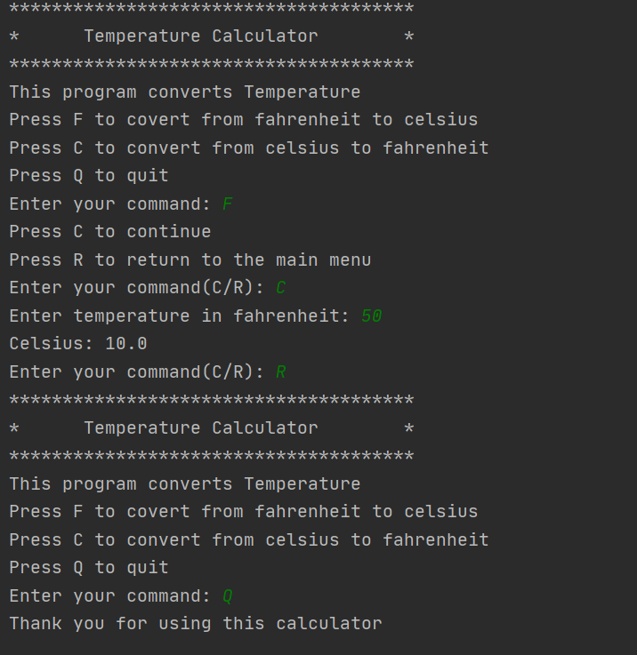

# Overview:
This program will convert temperature from fahrenheit to celsius and celsius to fahrenheit. 
It uses Java jdk 14.0.2 with intellij ide and github.

# Development Environment:
* Intellij
* java jdk 14.0.2

# Execution:
To execute the program: 'main.java' use javac followed by the filename.java and 
java followed by the filename.

# Useful Websites
* Java Reference
* [Linkedln Learning](https://www.linkedin.com/learning/paths/become-a-java-programmer?u=2153100)
* [W3school](https://www.w3schools.com/java/default.asp)